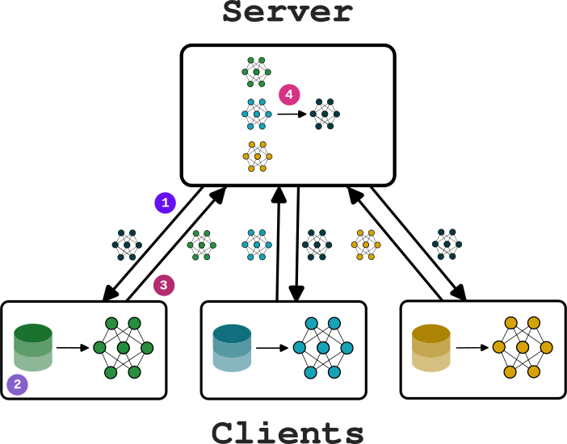
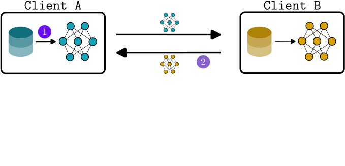

+++

title = "Proximity-based Self-Federated Learning"
description = "ACSOS 2024 main-track paper presentation"
outputs = ["Reveal"]
aliases = [
    "/guide/"
]

+++

# Proximity-based Self-Federated Learning

[Davide Domini](mailto:davide.domini@unibo.it) <i class="fa-solid fa-circle-nodes"></i>,
[Gianluca Aguzzi](mailto:gianluca.aguzzi@unibo.it) <i class="fa-solid fa-circle-nodes"></i>,
[Nicolas Farabegoli](mailto:nicolas.farabegoli@unibo.it) <i class="fa-solid fa-circle-nodes"></i>,
[Mirko Viroli](mailto:mirko.viroli@unibo.it) <i class="fa-solid fa-circle-nodes"></i>,
[Lukas Esterle](mailto:lukas.esterle@ece.au.dk) <i class="fa-solid fa-laptop-code"></i>

International Conference on Autonomic Computing and Self-Organazing Systems @ ACSOS 2024

 

{}
{}

<i class="fa-solid fa-circle-nodes"></i> Department of Computer Science and Engineering, University of Bologna, Cesena (FC), Italy
{}
{}

<i class="fa-solid fa-laptop-code"></i> Department of Electrical and Computer Engineering, Aarhus University, Aarhus (AAR), Denmark
{}
{}

---

# Use case





 <i class="fa-solid fa-angle-right" style="color: #22373b;"></i> <b>Scenario:</b> a decentralized system for healthcare monitoring 

 <i class="fa-solid fa-angle-right" style="color: #22373b;"></i> <b>Task:</b> predict potential health problems in our patients (e.g., stroke prediction) 

 <i class="fa-solid fa-angle-right" style="color: #22373b;"></i> <b>Problem:</b> users' privacy 

 <i class="fa-solid fa-angle-right" style="color: #22373b;"></i> <em>Solution:</em> Federated Learning 

 <i class="fa-solid fa-angle-right" style="color: #22373b;"></i> <b>Problem:</b> different users may have different health profiles (heterogeneous data)

 <i class="fa-solid fa-angle-right" style="color: #22373b;"></i> <em>Solution:</em> Clustered approaches 









<!-- ---
# Federated Learning in a nutshell



  
  {}

  ### Centralized Approach
  

  
  

  {}

  

  

      

  {}

 ### Pros 

 <i class="fa-solid fa-check" style="color: green;"></i> Reduces privacy concern 

 <i class="fa-solid fa-check" style="color: green;"></i> Transfer less data to the server 

{}
{}

### Cons

 <i class="fa-solid fa-xmark" style="color: red;"></i> Need for a central trusted entity 

 <i class="fa-solid fa-xmark" style="color: red;"></i> Single point of failure 

 <i class="fa-solid fa-xmark"style="color: red;"></i> Data heterogeneity 

{}

  


---

# Federated Learning in a nutshell (2)



  

  {}

 ### Peer-to-Peer Approach

  

  
  

  {}

  

  

  {}

  ### Still some cons

  
 <i class="fa-solid fa-xmark"style="color: red;"></i> Data heterogeneity 

  
 <i class="fa-solid fa-xmark"style="color: red;"></i> Communication overhead in the network 

  {}

  


-->
--- 

# Clustered Federated Learning





{}

 <i class="fa-solid fa-angle-right" style="color: #22373b;"></i> <em>Assumption:</em> clients can be divided in clusters (IID data within each cluster) 

 <i class="fa-solid fa-angle-right" style="color: #22373b;"></i> <em>Multiple models </em> are trained to target various local distributions 

 <i class="fa-solid fa-angle-right" style="color: #22373b;"></i> <em>Similarity measures:</em> loss based, gradient based, weight based 

{}





{}

 <i class="fa-solid fa-xmark"style="color: red;"></i> Clustering is performed by a central server 

 <i class="fa-solid fa-xmark"style="color: red;"></i> Number of clusters must be defined a priori 

{}





---

# Proximity-based Self-Federated Learning

---

# Formalization

  
  

  
 <i class="fa-solid fa-angle-right" style="color: #22373b;"></i> A spatial area $A = \{ a_1, ..., a_k \}$ divided into <em>$k$ distinct continuos area </em>

  
 <i class="fa-solid fa-angle-right" style="color: #22373b;"></i> Each area $a_j$ has a <em>unique local data distribution</em> $\Theta_j$ 

  
 <i class="fa-solid fa-angle-right" style="color: #22373b;"></i> A set of <em>sensor nodes</em> $S = \{ s_1, ..., s_n\} (n > |A|)$ are deployed in $A$ 

  
 <i class="fa-solid fa-angle-right" style="color: #22373b;"></i> Each sensor will be located in a <em>specific area</em> $a_j$ 

  
 <i class="fa-solid fa-angle-right" style="color: #22373b;"></i> Each sensor has a certain <em>communication range</em> $r_c$ 

  
 <i class="fa-solid fa-angle-right" style="color: #22373b;"></i> Each sensor $s_i$ has a certain <em>neighbourhood</em> $N_i$ 

  
 <i class="fa-solid fa-angle-right" style="color: #22373b;"></i> The complete <em>local dataset</em> $D_i$ is represented as $D_i = \{ (x_1, y_1), ..., (x_m, y_m) \}$ 

  

  

---

# What we want to obtain?

 <i class="fa-solid fa-angle-right" style="color: #22373b;"></i> Starting from the network of devices we want to <em>cluster devices into groups</em> following a certain similarity metric 

  
 <i class="fa-solid fa-angle-right" style="color: #22373b;"></i> Then, we want to <em>elect</em> some special nodes called <em>leaders</em> 

  
 <i class="fa-solid fa-angle-right" style="color: #22373b;"></i> Leaders could be elected following <em>different policies</em> (e.g., devices with the higher computational power) 

---

# Algorithm overview

    





  
  

  


---

# Loss based Similarity

> If the model trained by client A has a loss smaller than a certain threshold on the dataset of the client B (and viceversa),   then the two clients should be considered similar.

 





  
  

  


--- 

# Space-fluid sparse choice

 Let: </b>

 <i class="fa-solid fa-angle-right" style="color: #22373b;"></i> $m(n_1, n_2)$ be a <em>similarity metric</em> between two nodes 
 

 <i class="fa-solid fa-angle-right" style="color: #22373b"></i> $\sigma > 0$ be the <em>maximum acceptable error</em> 
 





  
  
  

  





  

  
  
Suppose: 

  
<i class="fa-solid fa-angle-right" style="color: #22373b;"></i> $m(l, n_1) + m(n_1, n_2) < \sigma$ 

  
<i class="fa-solid fa-angle-right" style="color: #22373b;"></i> $m(l, n_1) + m(n_1, n_2) + m(n_2, n_3) > \sigma$ 

  





--- 

# Experimental evaluation

 
{}

 <i class="fa-solid fa-angle-right" style="color: #22373b;"></i> <em> Dataset: </em> Extended MNIST - Handwritten Letters 

 <i class="fa-solid fa-angle-right" style="color: #22373b;"></i> <em> 26 classes </em> (latin alphabet) 

 <i class="fa-solid fa-angle-right" style="color: #22373b;"></i> <em> 124800 </em> train samples 

 <i class="fa-solid fa-angle-right" style="color: #22373b;"></i> <em> 20800 </em> test samples 

 <i class="fa-solid fa-angle-right" style="color: #22373b;"></i> Synthetically split in <em> {3, 5, 9} </em> areas 

 <i class="fa-solid fa-angle-right" style="color: #22373b;"></i> Simulations realized in <em>Alchemist</em>¹, algorithms written in <em>ScaFi</em>² 

 <i class="fa-solid fa-angle-right" style="color: #22373b;"></i> <em> Experiments </em> available and reproducible <a href="https://github.com/nicolasfara/experiments-2024-ACSOS-opportunistic-federated-learning"> here </a>

1. https://alchemistsimulator.github.io/

2. https://scafi.github.io/

{}

---

# Simulation

<video style="width: 70%;" autoplay loop muted playsinline>
  <source src="selfFL.mp4" type="video/mp4">
</video>

---

# Results (1)

---

# Results (2)

---

<!-- 



<h1> Conclusions </h1>

 

{}

 <i class="fa-solid fa-angle-right" style="color: #22373b;"></i> Federations are correctly created without defining a number of cluster a priori 

 <i class="fa-solid fa-angle-right" style="color: #22373b;"></i> PSFL adapts to different network topologies (centralized, semi-centralized, peer-to-peer)   

 <i class="fa-solid fa-angle-right" style="color: #22373b;"></i> Thanks to specialization is possible to use smaller models 

{}





<h1> Future work </h1>

 

{}

 <i class="fa-solid fa-angle-right" style="color: #22373b;"></i> Investigate the effect of node mobility on the federation' stability 

 <i class="fa-solid fa-angle-right" style="color: #22373b;"></i> Investigate the potential of PSFL to adapt to dynamic network topologies 

 <i class="fa-solid fa-angle-right" style="color: #22373b;"></i> Investigate the potential of PSFL to adapt to data distributions that change over time 

hierarchical?

{}




{}

{} -->

# Future work

 <i class="fa-solid fa-angle-right" style="color: #22373b;"></i> Using <em>sparse neural network</em> for low resource settings 

 <i class="fa-solid fa-angle-right" style="color: #22373b;"></i> Investigate the effect of <em>node mobility</em> on the federations stability 

 <i class="fa-solid fa-angle-right" style="color: #22373b;"></i> Investigate the potential of PSFL to adapt to <em>dynamic network topologies</em> 

 <i class="fa-solid fa-angle-right" style="color: #22373b;"></i> Integrate continual learning approaches to adapt to <em>data distributions that change over time</em> 

