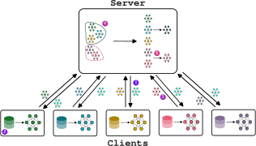

+++

title = "Proximity-based Self-Federated Learning"
description = "ACSOS 2024 main-track paper presentation"
outputs = ["Reveal"]
aliases = [
    "/guide/"
]

+++

# Proximity-based Self-Federated Learning

[Davide Domini](mailto:davide.domini@unibo.it) <i class="fa-solid fa-circle-nodes"></i>,
[Gianluca Aguzzi](mailto:gianluca.aguzzi@unibo.it) <i class="fa-solid fa-circle-nodes"></i>,
[Nicolas Farabegoli](mailto:nicolas.farabegoli@unibo.it) <i class="fa-solid fa-circle-nodes"></i>,
[Mirko Viroli](mailto:mirko.viroli@unibo.it) <i class="fa-solid fa-circle-nodes"></i>,
[Lukas Esterle](mailto:lukas.esterle@ece.au.dk) <i class="fa-solid fa-laptop-code"></i>

{}
{}

<i class="fa-solid fa-circle-nodes"></i> Department of Computer Science and Engineering, University of Bologna, Cesena (FC), Italy
{}
{}

<i class="fa-solid fa-laptop-code"></i> Department of Electrical and Computer Engineering, Aarhus University, Aarhus (AAR), Denmark
{}
{}

---
# Federated Learning in a nutshell



  
  {}

  ### Centralized Approach
  

  
  

  {}

  {}

#### Pros and cons




{}

 <i class="fa-solid fa-check" style="color: green;"></i> Reduces privacy concern 

{}
{}

 <i class="fa-solid fa-check" style="color: green;"></i> Transfer less data to the server 

{}



{}

 <i class="fa-solid fa-xmark" style="color: red;"></i> Need for a central trusted entity 

{}

{}

 <i class="fa-solid fa-xmark" style="color: red;"></i> Single point of failure 

{}

{}

 <i class="fa-solid fa-xmark"style="color: red;"></i> Data heterogeneity 

{}





{}

  
  
  {}

  ### Peer-to-Peer Approach
  

  
  

  {}

  

 

---

# Clustered Federated Learning

{}

{}

{}

 Assumption: clients can be divided in clusters (IID data within each cluster) 

{}

{}

 Multiple models  are trained to target various local distributions 

{}

{}

 Similarity measures: loss based, gradient based, weight based 

{}

---

# Use case

---

# Proximity-based Self-Federated Learning

---

# Algorithm overview





  
  

  


---

---

# Loss based dissimilarity





  
  

  


--- 

# Experimental evaluation

---

# Simulation

<video style="width: 70%;" autoplay loop muted playsinline>
  <source src="selfFL.mp4" type="video/mp4">
</video>

---

# Results (1)

---

# Results (2)

---

# Conclusions and future works

---